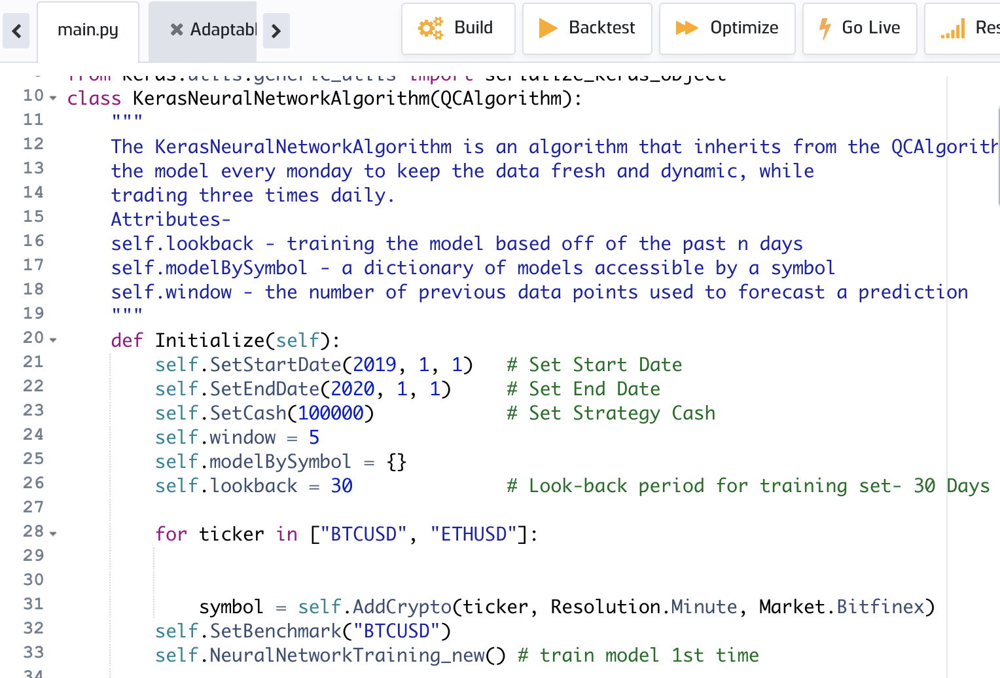
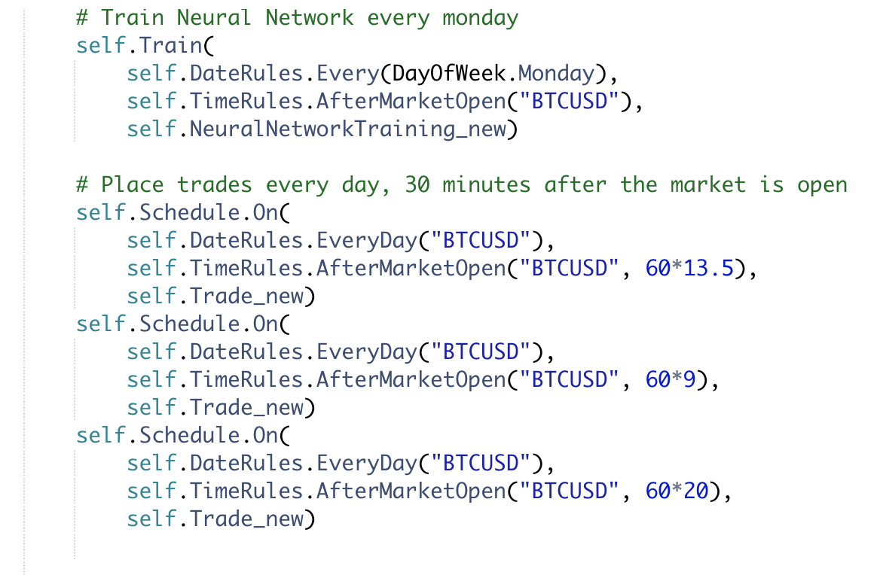
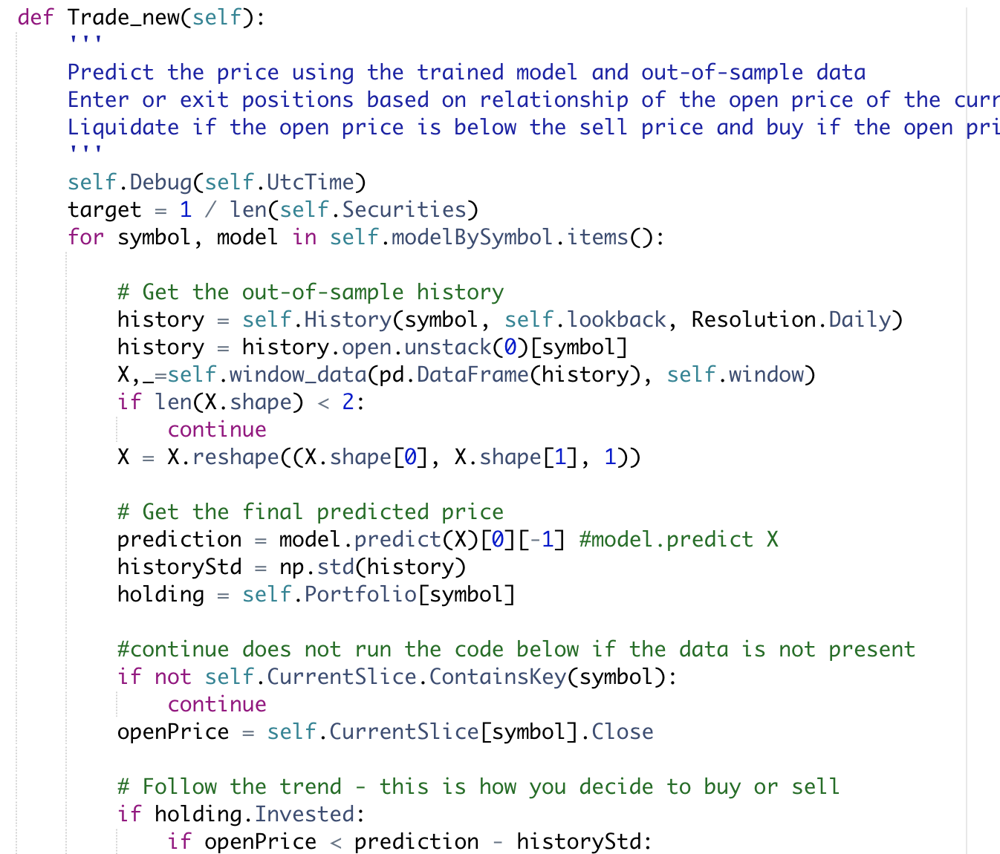
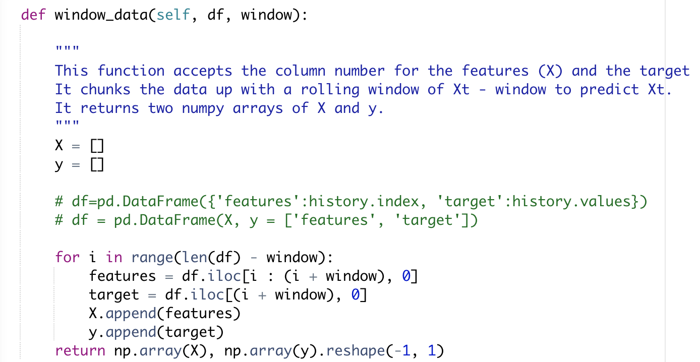
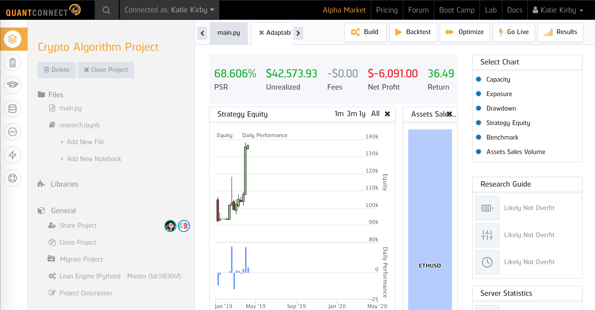
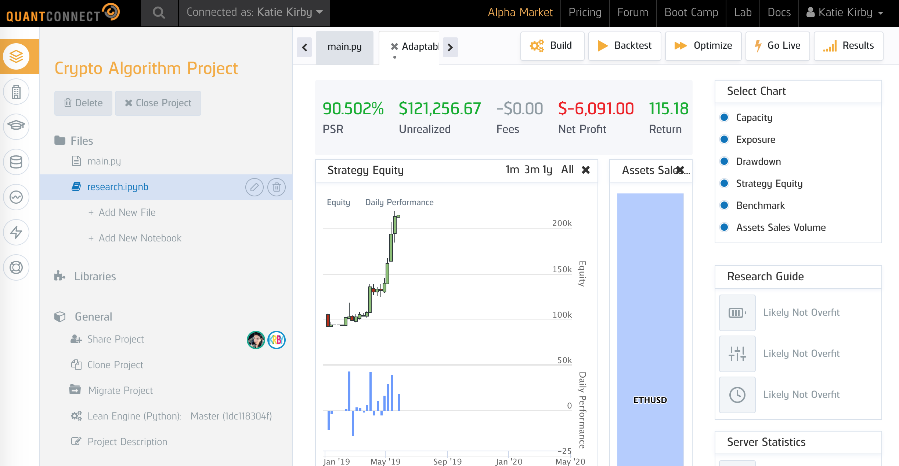
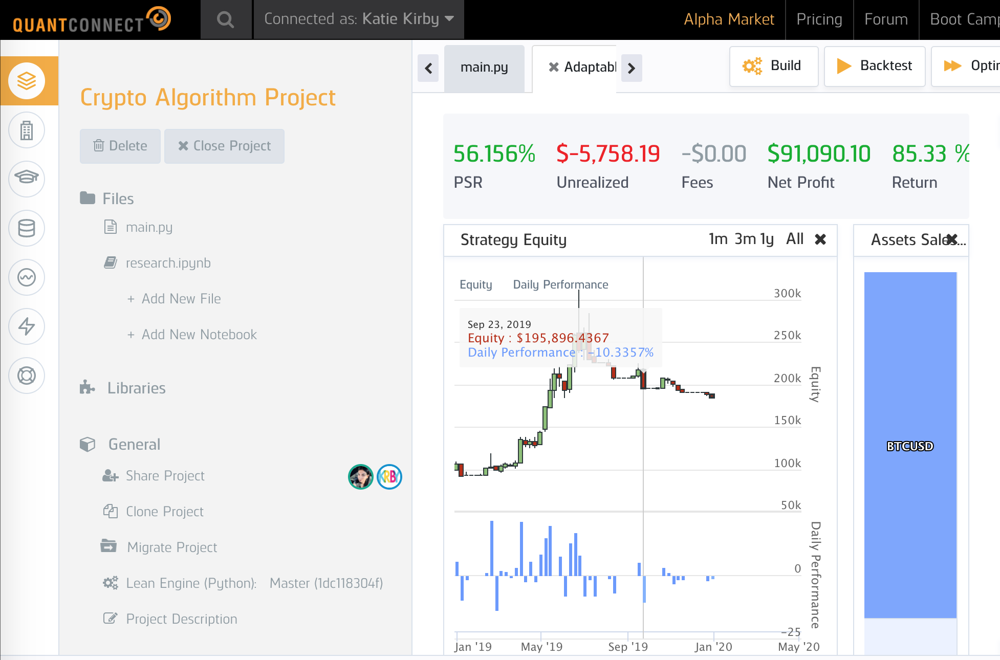
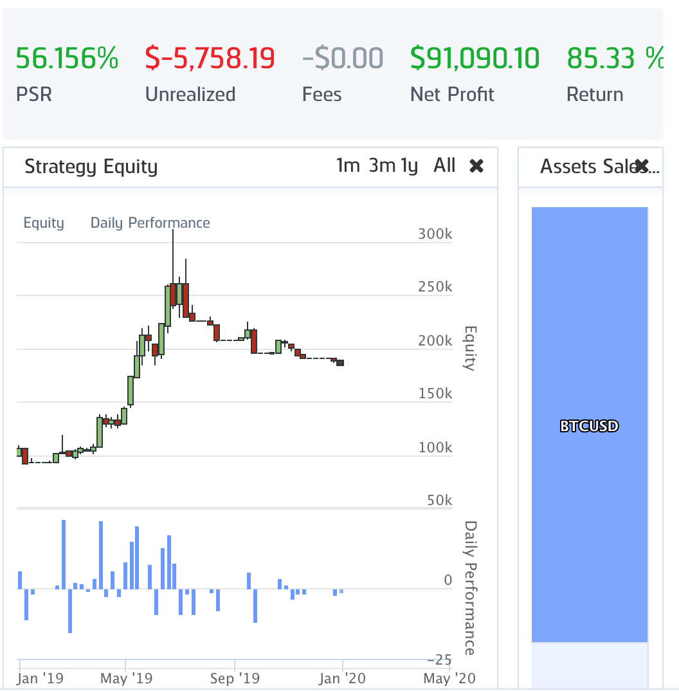

# Algorithmic Trading

## Description
We created an algorithmic trading bot to predict the future price of Bitcoin and Ethereum using back data.  We used machine learning models to test the back data and risk/performance.  We used QuantConnect to create our algorithm. 

## Research Question 
Can our algorithm beat the market by purchasing crypto when the currency price exceeds the deep learning model's forecasted price? 

## Datasets/Models 
We used historical data for Bitcoin and Ethereum from Bitfinex and then trained a NeuralNetworkAlgorithm to create trades based on the backtested data.  We are used the LSTM plus the standard deviation, as a threshold for identifying trends.

## Task Breakdown 
Source code from https://github.com/QuantConnect/Lean/blob/master/Algorithm.Python/KerasNeuralNetworkAlgorithm.py
We compiled back data for Bitcoin and Ethereum using Bitfinex and created a NeuralNetworkAlgorithm that accurately predicts future data. 

To begin, we defined the KerasNeuralNetworkAlgorithm. The KerasNeuralNetworkAlgorithm is an algorithm that inherits from the QCAlgorithm class.  It will be training
the model every monday to keep the model fresh and dynamic, while trading three times daily.

Attributes used for this are as follows:

self.lookback - trains the model based off of the past n days
self.modelBySymbol - a dictionary of models accessible by a symbol
self.window - the number of previous data points used to forecast a prediction

  
Then we defined the initialize function with Start Date, Set type of account, Window, ModelbySymbol and Lookback for BTC and ETH.

After this we set the Benchmark (BTCUSD) and trained the model the first time with our NeuralNetworkTraining_new function.

Following this we set the Neural network to train every Monday and scheduled it to trade 30 minutes after markets open in North America, Europe and Asia respectively.

We used daily historical data to train our machine learning model and built a neural network from 1st to last layer using the LSTM model.

We then trained the models.

We created a new trade function based on the source code provided to predict the price using the trained model and out-of-sample data.

Enter or exit positions are based on the relationship of the open price of the current bar (minutely) and the prices defined by the machine learning model.

Our algo enters a position if it doesn't have the position and if the current price breaks the deep learning model's predicited trend (plus 1 standard deviation).

Our model liquidates if it has a position and the current price drops below the deep learning model's predicited trend(-1 standard deviation).

We created a window_data function that accepts the column number for the features (X) and the target (y).

It chunks the data up with a rolling window of Xt and a window to predict yt.

It returns two numpy arrays of X and y.

We converted the window data to tensors.

We built the neural network for each asset this time changing LSTM, changing input_dim to input_shape, and giving it the correct shape.

In the future, to further improve the model we could tune the model in a research notebook:

we could adjust the weight's logic 

we could adjust the time we look back

we could add indicators 

we could add more coins and we could adjust the window 

Charts - 

Benchmark is the price of bitcoin

Daily Performance of our algorithm is the first chart

Our Algo did not beat the benchmark 

Our algo's largest draw down was 36%

BTC's largest draw down was similar 

Our Algo's Annual Standard Deviation was .392

